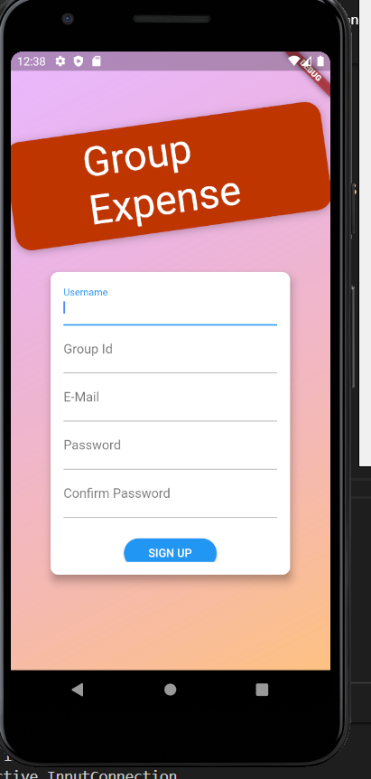
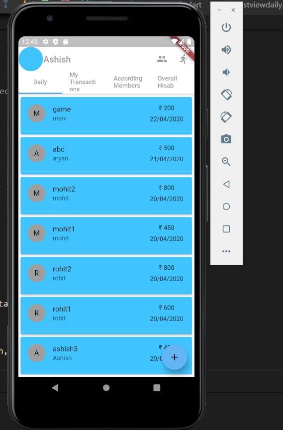
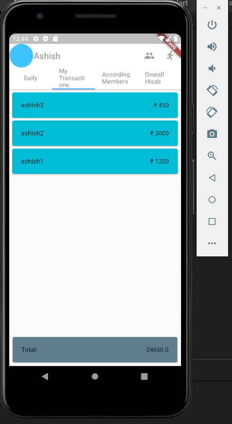
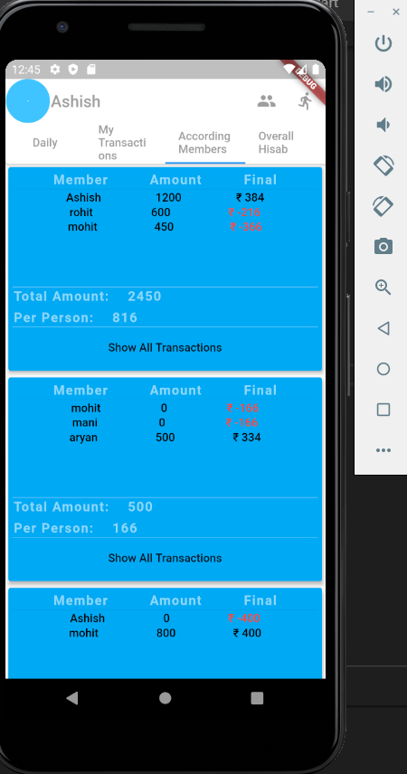
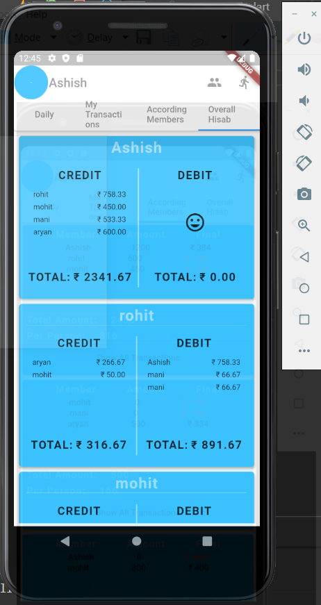
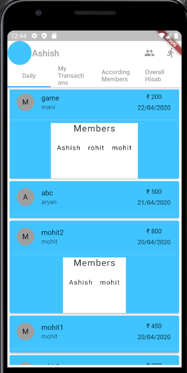
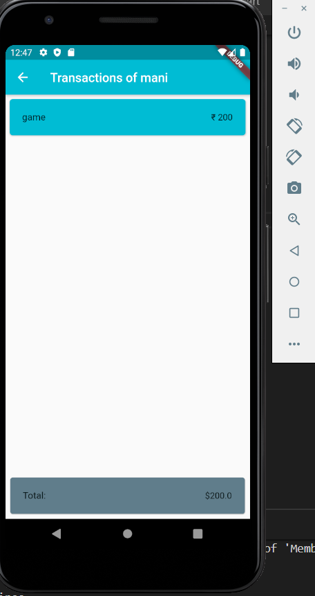

# groupexpense

A new Flutter project.

Sign up Page:

Daily Transactions:

Every person can add his transaction and all group members can preview it.

My Transactions: 

According Members:
show transactions according to members like if three people are present at that time then that members will be show only and hisab is done between those 3 members and also shows all transactions of those members.

Overall:
shows every person credit (that much particular person will take from others ) and Debit will show how much he have to give.

Expanded : Show members for particluar transaction.

Transaction of Particular Members: 

